# AppealWriter AI - Architecture Overview

## What It Does

AppealWriter AI is an AI-powered tool that helps healthcare providers appeal denied medical insurance claims. It analyzes denial letters and clinical notes to automatically generate professional, evidence-based appeal letters.

## Core Problem Solved

When insurance companies deny medical claims, providers must manually:
1. Review the denial letter to understand why the claim was rejected
2. Search through clinical notes to find supporting evidence
3. Identify coding errors (ICD-10/CPT mismatches)
4. Write a formal appeal letter with specific citations

AppealWriter AI automates this entire workflow using AI.

---

## High-Level Architecture

```mermaid
flowchart LR
    A["📄 INPUT<br/><br/>Denial Letter<br/>+<br/>Clinical Notes"]
    B["🤖 APPEAL AGENT<br/><br/>AI Orchestrator<br/>(agent.ts)"]
    C["🧠 GPT-4<br/><br/>Document Analysis<br/>Reasoning Engine"]
    D["🔍 ICD-10 TOOL<br/><br/>Semantic Code Search<br/>(tools.ts)"]
    E["✅ OUTPUT<br/><br/>Appeal Letter<br/>+<br/>Activity Logs"]
    
    A -->|Process| B
    B -->|Analyze| C
    C <-->|Search Codes| D
    C -->|Generate| E
    
    style A fill:#e3f2fd,stroke:#1976d2,stroke-width:3px,color:#000
    style B fill:#fff3e0,stroke:#f57c00,stroke-width:3px,color:#000
    style C fill:#fce4ec,stroke:#c2185b,stroke-width:3px,color:#000
    style D fill:#f3e5f5,stroke:#7b1fa2,stroke-width:3px,color:#000
    style E fill:#e8f5e9,stroke:#388e3c,stroke-width:3px,color:#000
```



---

## Component Breakdown

### 1. **Entry Point** ([index.ts](src/index.ts))
**Role:** CLI interface and output formatting

- Parses command-line arguments (denial letter path, clinical notes path)
- Initializes the `AppealAgent`
- Displays results to console with formatting
- Saves appeal letter and activity logs to files

**Key Flow:**
```
Read inputs → Create agent → Generate appeal → Format & save output
```

---

### 2. **AppealAgent** ([agent.ts](src/agent.ts))
**Role:** Multi-turn AI reasoning orchestrator

This is the brain of the application. It manages a conversation loop with Azure OpenAI where:

1. **Initial Request:** Sends denial letter + clinical notes to GPT-4 with system prompts
2. **Tool Calling Loop:** GPT-4 can request ICD-10 code searches multiple times (up to 3 iterations)
3. **Final Response:** GPT-4 returns structured JSON with the complete appeal analysis

**Key Features:**
- Multi-turn conversation (allows GPT-4 to gather information iteratively)
- Logging all tool calls and responses
- Enforces JSON output format on final iteration

**Conversation Example:**
```
User → "Analyze this denial and notes"
GPT-4 → "I need to search for preventive exam codes"
Tool → Returns Z00.00 codes
GPT-4 → "I need to verify the headache code"
Tool → Returns R51 code
GPT-4 → [Final JSON with complete appeal]
```

---

### 3. **ICD10SearchTool** ([tools.ts](src/tools.ts))
**Role:** Semantic search for medical billing codes

Uses **vector embeddings** to find relevant ICD-10 codes:

**How It Works:**
1. **Pre-computed Embeddings:** All ~70K ICD-10 codes have been embedded using Azure OpenAI's `text-embedding-3-small` model (stored in [icd10-embeddings.json](src/icd10-embeddings.json))
2. **Query Embedding:** When GPT-4 asks to search (e.g., "preventive wellness exam"), the tool embeds the query
3. **Cosine Similarity:** Computes similarity scores between query and all code embeddings
4. **Code Type Filtering:** Optional filter for diagnosis codes (ICD-10-CM) or procedure codes (ICD-10-PCS) only
5. **Top Results:** Returns the 10 most similar codes with descriptions, category, and code type

**Example:**
```
Query: "preventive wellness exam", code_type: "diagnosis"
Results:
  1. Z00.00 [diagnosis]: Encounter for general adult medical examination without abnormal findings
  2. Z00.01 [diagnosis]: Encounter for general adult medical examination with abnormal findings
  ...
```

---

### 4. **Prompts** ([prompts.ts](src/prompts.ts))
**Role:** Instructions for GPT-4

Contains:
- **System Prompt:** Defines the agent's role as a medical billing specialist
- **User Prompt Template:** Structures the input (denial + notes) with clear instructions
- **Output Schema:** Specifies the exact JSON format for the appeal response

---

### 5. **Types** ([types.ts](src/types.ts))
**Role:** TypeScript type definitions

Defines the structure of:
- `AppealResponse`: The final output schema
- `CodeValidation`: Structure for billing code analysis
- `BilledCode` / `SuggestedCode`: Individual code validation results

---

### 6. **Scenarios** ([scenarios.ts](src/scenarios.ts))
**Role:** Test scenario management

Provides a structured way to run pre-built test cases:

**Features:**
- Defines 5 test scenarios with descriptions and file paths
- `getScenarioById()`: Lookup scenario by ID or name
- `listScenarios()`: Display all available test scenarios
- Enables quick testing via `--scenario <number>` CLI flag

**Available Scenarios:**
1. Medical Necessity
2. Coding Mismatch
3. Pre-Authorization
4. Bundling/NCCI Edits
5. Experimental Treatment

---

## Data Flow


---

## Supported Scenarios

### 1. **Medical Necessity Gap**
- **Problem:** Insurance claims treatment wasn't necessary or lacks documentation
- **Solution:** AI searches clinical notes for evidence of conservative treatments (PT, medications)
- **Example:** MRI denied for "lack of conservative care" → AI finds 6 weeks of PT in notes

### 2. **Coding Mismatch**
- **Problem:** Wrong ICD-10 code used for procedure (e.g., diagnostic code on preventive visit)
- **Solution:** AI validates CPT-to-ICD-10 pairing and suggests corrections
- **Example:** Preventive visit (CPT 99385) billed with R51 (headache) instead of Z00.00 (wellness)

### 3. **Pre-Authorization Issue**
- **Problem:** Treatment denied for late or missing authorization, but urgent circumstances applied
- **Solution:** AI identifies timeline conflicts and extracts emergency clinical documentation
- **Example:** Surgery denied for late auth → AI finds ER visit documentation showing acute deterioration

### 4. **Bundling/NCCI Edits**
- **Problem:** Multiple CPT codes denied as bundled services per NCCI guidelines
- **Solution:** AI validates CPT code hierarchy and identifies if denial is justified or appealable
- **Example:** Colonoscopy codes 45378 and 45380 → AI recognizes 45380 is comprehensive code

### 5. **Experimental Treatment**
- **Problem:** Treatment denied as experimental/investigational per policy
- **Solution:** AI documents all failed standard treatments and builds appeal on exceptional circumstances
- **Example:** PRP injections denied → AI shows all alternatives exhausted, patient too young for surgery

---

## Key Technologies

- **Azure OpenAI (GPT-4):** Reasoning, document analysis, appeal writing
- **Azure OpenAI Embeddings:** Semantic search for ICD-10 codes (text-embedding-3-small)
- **OpenAI SDK:** Tool calling (function calling) for multi-turn agent behavior
- **TypeScript:** Type-safe development
- **Commander.js:** CLI argument parsing

**Environment Variables Required:**
- `AZURE_OPENAI_ENDPOINT`, `AZURE_OPENAI_API_KEY`, `AZURE_OPENAI_DEPLOYMENT` - GPT-4 model
- `AZURE_EMBEDDINGS_ENDPOINT`, `AZURE_EMBEDDINGS_API_KEY`, `AZURE_EMBEDDINGS_DEPLOYMENT` - Embedding model

---

## Why This Design?

1. **Multi-turn Agent:** Allows GPT-4 to iteratively gather information rather than trying to answer everything in one shot
2. **Semantic Search:** Embedding-based search is more robust than keyword matching for medical terminology
3. **Tool Calling:** GPT-4 decides when to search codes based on context, not hard-coded rules
4. **Structured Output:** JSON schema ensures consistent, parseable responses
5. **Logging:** Full audit trail of agent decisions for debugging and transparency

---

## Example Usage

```bash
# Run a test scenario
npm run scenario:1
npm start -- --scenario 2

# Use custom files
npm start -- \
  --denial examples/coding-mismatch/denial.txt \
  --notes examples/coding-mismatch/notes.txt
```

**Output:**
- Console display with scenario, evidence, and appeal letter
- `output/appeal-2025-12-13.txt` - Ready-to-send appeal
- `output/logs-2025-12-13.txt` - Agent activity logs
